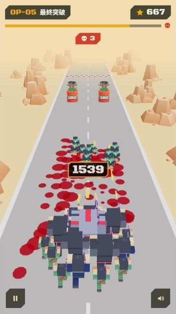

# Frontline Breakthrough 前線突破

### ▶ [立即遊玩](https://johiny530.github.io/frontline-breakthrough/)

https://johiny530.github.io/frontline-breakthrough/

電腦和手機的瀏覽器都能玩，不用下載安裝。

遊戲有中文和英文兩種語言，主選單最下面可以切換。*English is available: tap "English" at the bottom of the main menu.*

帶著部隊衝過殭屍佔領的沙漠公路。射擊閘門讓數字變大，打破木桶救出同伴，用人數淹沒擋在前面的殭屍。

## 操作

| | 電腦 | 手機 |
|---|---|---|
| 左右移動 | ← → 或 A D，也可以用滑鼠拖曳 | 手指左右拖曳 |
| 暫停 | Esc | 左下角按鈕 |
| 選強化卡 | 1、2、3 或點擊 | 點擊 |
| 音效開關 | 右下角按鈕 | 右下角按鈕 |

士兵會自動開槍，你只需要決定往哪裡走。

## 怎麼玩

- **閘門**：藍色加兵，紅色扣兵；寫「×」的是倍率，走錯一次兵力可能直接減半。對閘門開槍會讓數字變大，紅色閘門也能打回來
- **木桶**：上面的數字是血量，打破後，站在上面的士兵會加入你的隊伍。直接撞上去會損兵
- **殭屍**：碰到隊伍時會跟士兵一換一同歸於盡，血越厚的殭屍換掉越多士兵
- **階級**：每 10 個同階單位會合成 1 個上一階：小兵（1 人）、軍官（10 人）、特種兵（100 人）、機器人（1000 人）。頭上的數字永遠是總人數
- 人數歸零就失敗

## 遊戲模式

### 戰役：OP-01 ～ OP-05

五個關卡，難度逐關上升，OP-05 的終點有巨型殭屍 Boss。過關分數：擊殺數 + 打破木桶的血量 + 生還士兵 × 5。每關的最高分都會記錄下來。

### 無限作戰（打通 OP-05 後解鎖）

一路往前打，看你能撐到第幾段。

- 每段路都是隨機產生的，越後面跑得越快、殭屍越多
- 每突破一段，從三張強化卡選一張：速射、高爆彈、散射、過載、防彈衣、戰地徵兵、賞金獵人、增援部隊……
- 路上的金色補給箱打破後，會立刻送你一張隨機強化
- 會出現子彈打不掉的**尖刺陷阱**，只能閃過去
- 第 3 段起有速度很快的紅色**快跑者**，第 6 段起有血很厚的**巨漢**
- 每 5 段一隻 Boss，打贏可以多選一次強化
- 陣亡後依成績拿到勳章，可以在「軍需處」買永久升級：開局兵力、傷害、射速、閘門、防護、爆破、Boss 傷害、救援、每段徵兵、勳章收入、出擊前先選強化卡等等
- 升級沒有上限，每一級的效果用乘的累積，等級越高加成越大，價格也越貴。難度只看你打到第幾段，越後面越難
- 想從頭開始，軍需處最下面有「重置無限模式進度」

## 小技巧

- 先對著閘門開槍，等數字變大再穿過去
- 人多的時候，倍率閘門比加減閘門划算得多
- 兩道都是紅色閘門時，從中間的縫隙穿過去就不會被扣兵
- 擋路的木桶太硬就繞開，硬撞的損失很大
- 尖刺一定要閃，它不會被打掉

## 存檔

進度存在你自己的瀏覽器裡，不會上傳到任何地方。換一台裝置、換一個瀏覽器，或清除網站資料之後，進度會重新開始；無痕視窗不會保存進度。

## English

**Play:** https://johiny530.github.io/frontline-breakthrough/ (switch the language with the button at the bottom of the main menu)

Lead your squad down a zombie-infested desert highway. Your soldiers fire on their own; you only steer.

- **Gates**: blue adds troops, red removes them, "×" multiplies. Shooting a gate raises its number, even a red one
- **Barrels**: the number is their hp. Break them to free the soldiers standing on top; ramming them costs troops
- **Zombies**: each one that reaches you takes soldiers with it, more for tougher zombies
- **Ranks**: every 10 units of a rank merge into one of the next rank; the number above your squad is always the total
- **Endless Ops** (unlocks after OP-05): random sectors that get harder the further you go, a perk card after each sector, a boss every 5 sectors, and medals to spend on uncapped permanent upgrades in the Armory

Progress is saved in your own browser only.

## 致謝

- 3D 模型：[Kenney](https://www.kenney.nl)（CC0 授權），詳見 [CREDITS.md](CREDITS.md)
- 玩法靈感來自手機遊戲《Last War: Survival》裡的〈Frontline Breakthrough〉小遊戲
